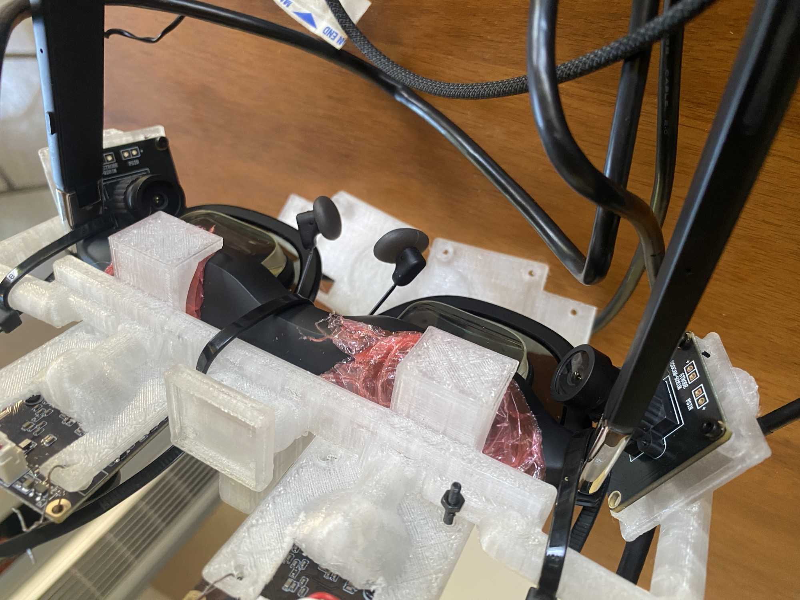
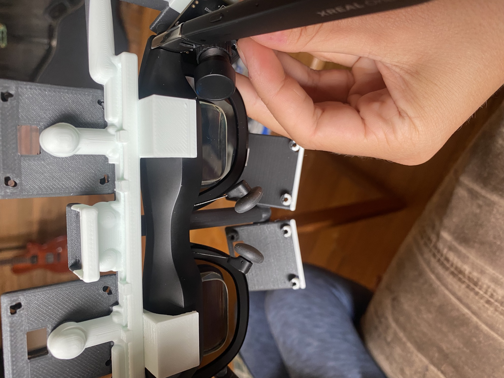
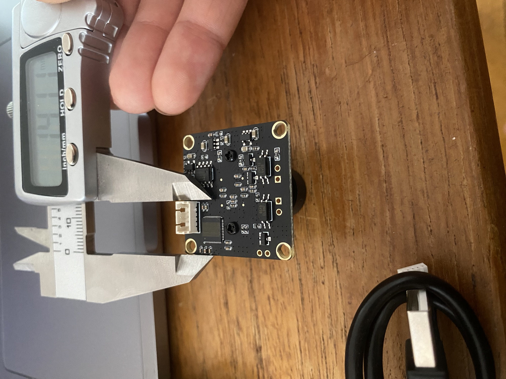
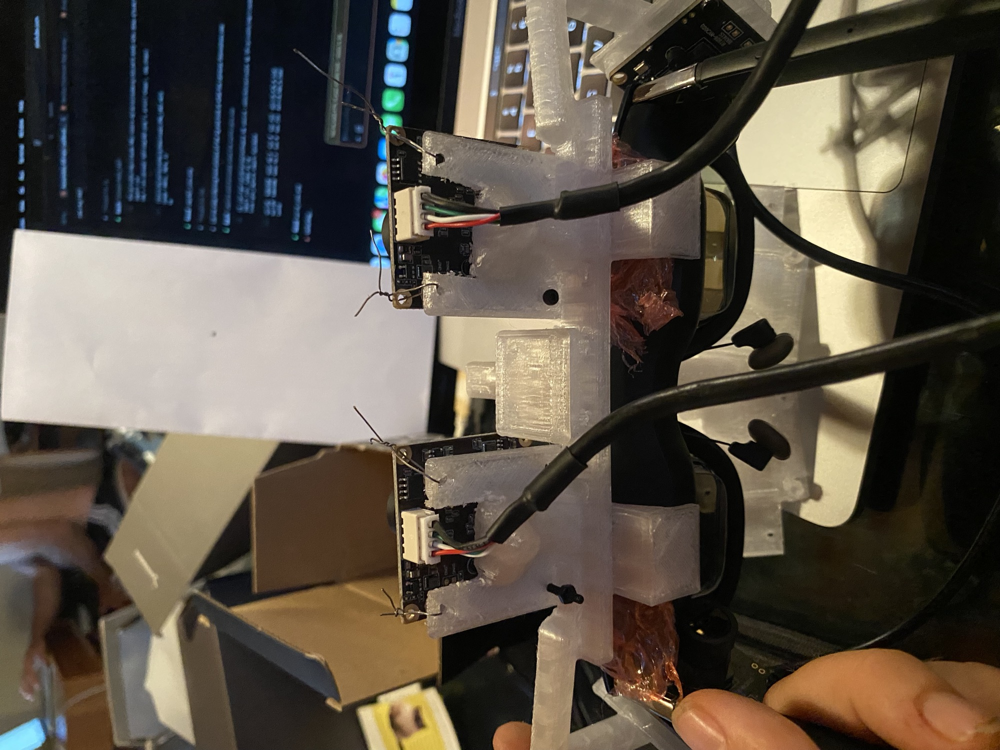

# AR Eye Calibration Rig

AR glasses drift on your face all day, and every millimeter of slip moves where a display
pixel lands in the real world. This project is a camera rig and learning system that
measures how the glasses sit on your face in real time and corrects the overlay, so that
a pixel meant to land on a real object actually lands on it.

I designed and built this from scratch: the physics simulation, the calibration math, the
3D printed camera mount, the electronics and safety design, and the verification tooling
that checks all of it. 

I was able to achieve results with 4 cams so 6 may not be necessary if you lack the 
compute to run a 6-cam model. I mostly did this because the 6th cam arrived
weeks later. Also, my power hub struggled on four so unless you have some heavy-duty hardware, 
4 may be the way to go.

## Build overview and results

The rig is a 6-camera clip-on carrier for the XREAL One Pro AR glasses:

- 2 forward color cameras (global shutter) that triangulate a target drawn on paper
- 2 cameras watching the corners of your eyes, which is how the rig knows the glasses
  pose on your face at every instant
- 2 near-infrared cameras imaging each pupil, with 940 nm illumination behind hardware
  safety interlocks
- an IMU for slip and bump detection, all on one printed part that clamps to the glasses
  brow with padded jaws shaped to the measured curve of the frame

I drew up two versions of this carrier, an eight-camera one that adds a stereo pair and the
six-camera one above, and started with six. When the first cameras arrived I built a
four-camera rig from them, the two forward and the two watching my eye corners, and every
measurement in this repository so far was taken on those four. The fifth camera has arrived
and the sixth is on its way; the near-infrared pupil pair is the last thing to go in. The
parts lists still cost out the eight-camera version, which is where the sub-pixel work would
go.

Results so far, from a physics simulation built to be pessimistic about human error:

- With a naive calibration interface, deployed accuracy is about 13 pixels. Most of that
  error is the human in the loop, not the optics.
- With the interface I built instead (a vernier alignment task plus a per-user offset
  stage), simulated deployed accuracy is about 4.3 pixels as the user perceives it, on a
  1080p display per eye.
- The same pipeline with ideal inputs reaches 0.89 pixels, so the hardware and math
  support sub-pixel registration. Closing that gap requires a multi-distance
  calibration protocol that only works on real hardware, which is now implemented:
  the best hardware run to date came in under 10 pixels of measured overlay error,
  down from the 13 a naive interface predicts. That is one run, not a characterized
  average and tightening it toward the simulated 4.3 is the current work.
- Just as important are the negative results. I tested and rejected several appealing
  shortcuts (bias-invariant fingerprints, richer per-user correction models, direct
  geometry refinement on user labels) because the simulation showed each one quietly
  overfits. The failures shaped the design as much as the successes.

 I also got the rig to draw an outline around a star shape on my wall, matching its 
 orientation and size, and the outline held on the shape as I moved my head. That is the closest
 the project has come to my end goal of real-world object overlay: not placing a marker at a point, 
 but tracing the boundary of an actual object and keeping it there under motion. My computer then 
 failed and that code was lost. I plan to rebuild it once the machine is repaired.



Current status: the rig is built and running on my face. All four cameras stream, both eye
trackers lock onto my inner eye corners, the forward pair finds the target and measures its
distance, and the whole preflight passes. I have real calibration samples stored and a
measured overlay error rather than a simulated one.

What the hardware phase actually produced, all measured on the rig:

- Overlay latency went from 196 ms to 62 ms once I worked out that most of it was my own
  smoothing rather than the cameras.
- I reverse engineered the IMU inside the glasses, which streams over TCP at about 1100 Hz.
  Nobody had documented the format, so I read raw packets and found the gyroscope and
  accelerometer by checking a stationary reading against gravity: 9.773 against 9.81.
- The overlay is now computed from physics rather than learned from scratch. A polynomial
  fit on few samples was throwing the marker across the display, so geometry became the
  backbone and learning became a correction that has to prove it helps before it is used.
- The display field of view had been assumed at 50 degrees since the project started. I
  measured it two ways and it is closer to 48, which was worth more error than getting a
  user's eye spacing wrong by two standard deviations.

## Why this problem

An AR display pixel corresponds to a ray leaving your eye through the optic into the
world. Where that ray lands depends on three things: the pixel you light up, the fixed
optics of the display, and where the glasses currently sit relative to your eyeball
(eye relief, slip down your nose, a few degrees of tilt, your IPD). That third item is
the killer. Shift the glasses 2 mm and the same pixel lines up with a different point in
the world. This is why one-time AR calibration never holds.

The key idea, which came out of an early design discussion with our robotics coach Chiem,
is to measure the glasses-on-face pose continuously by watching the corners of your
eyes. The inner canthus, the tear duct corner, is a stable facial landmark fixed to the
skull rather than to the eyeball, so its position in a glasses-mounted camera tells you
exactly how the glasses are seated right now without being confused by where you are
looking. I checked that property rather than assuming it: the landmark my model tracks
correlates with pupil position at 0.19, where the hand-tuned tracker it replaced sat at
0.99.

Reading the eye tracking literature later confirmed this was the right call for a reason
I had not known. Trackers that build a 3D model of the eye can compensate for the headset
sliding around, and purely 2D video methods have no known solution for it. Since my mount
is zip tied and does not sit the same way twice, that compensation is not a nice extra.
It is the only thing keeping a calibration valid for more than one session. The
system then learns a function from (target direction, eye corner geometry) to the
display pixel that lands on the target, using samples the user labels:

1. The forward camera pair finds a dot drawn on paper and triangulates it.
2. The model predicts a pixel and renders a red dot there.
3. You nudge with the arrow keys until the red dot sits on the real dot.
4. On approve, the rig snapshots the eye corner cameras at that instant and stores the
   sample.
5. Retrain, move the dot, re-seat the glasses, repeat.

After enough samples the function generalizes and places pixels correctly on its own,
even as the glasses move. Precision comes from the interface: the alignment task is a
vernier judgment (lining up segments, which people do several times more precisely than
covering a dot), because the simulation showed calibration accuracy is gated by the
quality of human corrections more than by any sensor.

## Why the XREAL One Pro

I originally wanted to modify Meta glasses, since they already carry cameras. They turn
out to be closed systems: Ray-Ban Meta has no display, and Meta Ray-Ban Display exposes
no framebuffer or camera access. The XREAL One Pro presents to the host as a normal
USB-C DisplayPort monitor, so the overlay renders to it with zero reverse engineering.
It is see-through with a display per eye, and it has a rigid front frame the printed
carrier clamps onto. The software is display-agnostic, and the CAD supports the Rokid
Max as a drop-in alternative.

## What is in the repo

- `software/` is the simulation and application code. The physics simulator models eye
  anatomy across a population, glasses slip, camera noise, lens distortion, blinks, and
  human error in the calibration loop. The application runs the live calibration with
  real cameras or fully simulated ones. Everything has self-tests.
- `cad/` is the parametric OpenSCAD model of the carrier. Camera positions are locked to
  the simulator's geometry file, and a parity check fails the build if the CAD and the
  simulation ever disagree about where a camera sits or points.
- `software/verify_all.py` is the release gate: one command that compiles everything,
  runs every self-test, checks CAD-to-simulation parity, verifies the printed solids
  against 35 pairwise clearance checks (parts against each other, the glasses body, the
  eyeballs, and the see-through view cones), exports the STL, and confirms it is a
  single connected solid.
- `ORDER_LIST.md`, `WIRING.md`, `ASSEMBLY.md`, `SAFETY.md`, and `EYE_TRACKING.md` cover
  parts, wiring with the power and interlock architecture, build steps, the hazard
  review, and the IR eye-safety design.
- `RESEARCH.md` maps the project onto the published state of the art (corneal-imaging
  calibration, PCCR gaze tracking, slippage-robust methods, synthetic training data,
  Quest Pro and Vision Pro benchmarks).

## The build



Every mount dimension came off a pair of calipers rather than a datasheet, because the
camera boards did not match their published drawings closely enough to trust.





The zip ties are load bearing. The carrier was designed for M3 thumbscrews and the printed
clamps did not hold well enough, so the working mount is zip tied. That is not tidy, but it
is honest about what the software has to survive: the mount does not sit the same way twice,
which is exactly the problem the eye corner cameras exist to solve.

More photos and what each shows: `media/session-2026-08-04/README.md`.

## Try it without hardware

The whole loop runs in simulation. It fakes the cameras and synthesizes ground truth, so
you can watch the model learn:

```bash
cd software
python3 -m venv .venv && source .venv/bin/activate
pip install -r requirements.txt
python3 main.py --simulate     # arrow keys nudge, ENTER approves, Q quits
```

`python3 verify_all.py --fast` runs the release gate's quick tier. See
`software/README.md` for the full module breakdown.

## Building the hardware

1. Print the carrier from `cad/xreal_one_mount.scad` and the IR rings as a second small
   print. The clamp jaws are shaped to caliper measurements of the actual glasses brow,
   taken from a hand-drawn dimensioned sketch and fitted with a spline.
2. Buy parts per `ORDER_LIST.md`. Cameras: 4 global-shutter mono modules for the eye
   side, 2 global-shutter color modules for the world side. Color matters there because
   the world cameras are the color reference for generated overlay content.
3. Clamp the carrier on, wire everything through a powered USB hub (one USB-C cable to
   the computer), and read `SAFETY.md` and the IR interlock section of `WIRING.md`
   before powering any LED.
4. Run the corner calibration once, then run the loop.

The safety design assumes failure: the IR LED current limits are set so that even a
stuck-on illuminator stays under conservative exposure limits, with the strobe and
watchdog as extra margin rather than the safety mechanism.

## Large-scale simulation studies

The repo includes the tooling I used to answer design questions with data instead of
guesses: population studies across thousands of simulated eyes, a pixel-by-pixel sweep
that walked 100 eye geometries times 100 glasses positions across the display (about
198 million labeled corrections), and ablations that measured what each sensor actually
contributes. Several cameras earned their place in the build this way, and one proposed
sensor (an IMU for pose estimation) was demoted to bump detection because the data said
it added nothing to registration.

That last conclusion turned out to be half right and worth revisiting. The IMU adds
nothing to registration accuracy, which the simulation had correctly shown. What it does
add is speed, and I only understood that after measuring latency on real hardware. The
cameras run at about 18 frames per second while the glasses' own IMU runs at 1100, and
overlay error from lag scales with how fast you turn your head. So the sensor the
simulation demoted came back as the fix for a different problem than the one I had
tested it against.

## What went wrong, and what that taught me

The most useful part of this project has been the failures, so they are documented in the
repo rather than quietly fixed.

The pattern that cost the most time, roughly ten separate instances, is a check passing for
a reason unrelated to what it claims to measure. A camera bring-up printed "BANK UP" with
two cameras returning nothing. A stereo geometry check took the absolute value of disparity
and so could not see that the two cameras were swapped. A template scored 0.99 on a patch of
blank skin. Three separate self-tests measured nothing at all until I rewrote them, one
because the synthetic signal ran off the edge of the frame within twenty frames and the rest
of the test window was a flat line.

The habit I built from that: when adding a check, write the failing case first and confirm
it actually goes red against the broken version. And when a number and an image disagree,
believe the image. Nearly every wrong turn I took came from trusting a measurement taken
while the glasses were sitting on my desk instead of on my face.

The second lesson is about tools versus problems. I spent a long time tuning a filter to fix
overlay lag, trading smoothness against delay and never getting both. A filter has one knob
and cannot do it. The answer, which the literature has known since the 1990s, is to predict
where your head will be when the light actually reaches your eye. That is not a better
filter, it is a different category of solution, and no amount of tuning would have found it.

## Acknowledgments

The eye-corner measurement idea came from our robotics coach, Chiem. Much of the early
speculation and problem-solving came out of design discussions with him.

I built this with AI assistance, which is why several commits carry a co-author trailer.
It wrote code alongside me and helped draft documentation. What it did not do is decide
what to build or what the results mean: the architecture, the experiments, the decision to
demote the IMU after an ablation showed it added nothing to registration, the negative
results above, and the corrections I have had to make to my own earlier conclusions are
mine. I have tried to write down the wrong turns as carefully as the working ones, because
on a project like this those are the part worth reading.

## License

Personal research project. Do what you like with it.
